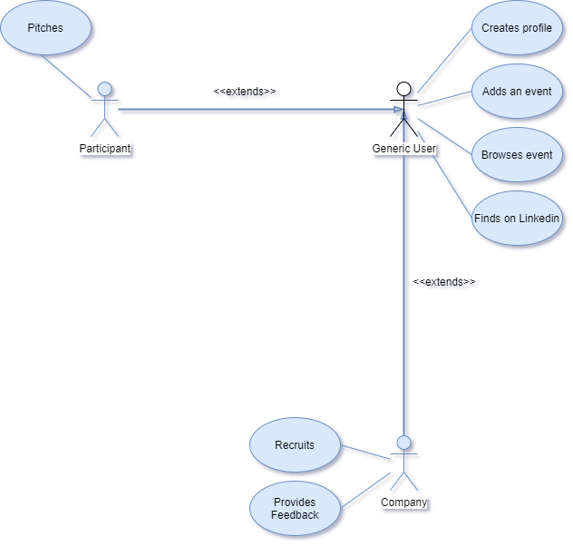

# NetFair  
#### Connect With Your Future

### Overview

As of today's circumnstances due to COVID-19 virus, few events are prepared to effectively deliver the experience we, as atendees, are used to receive. Everythin's often confusing and messy because of the high number of participants, and it's quite more difficult to methodicaly organize conferences and meetings within this specter. As participants it's not easy to understand which companies are interested in you, with whom should you aim to connect, or even how to find key individuals that also partake on the event in social media. As companies, it's hard to navigate through an overwhelming sea of participants, and filtering all the relevant information can prove to be a daunting challenge.

So we want to facilitate the entire process by showing the user who is participating on a given online conference (within a certain even), as well as all the companies present; mediate connections between participants and conferencees; and overall smoothen information filtering for both sides. All this to provide a cleaner, more organized experience for everyone envolved in those events.

### Use Cases

##### Diagram

##### Table 

Use Case ID | Use Case Name     | Primary Actor | Complexity |      
----------- | ----------------- | ------------- | ---------- |
1           | Creates profile   | Generic User  | High       |
2           | Adds an event     | Generic User  | Low        |
3           | Browses event     | Generic User  | High       |
4           | Finds on LinkedIn | Generic User  | Low        |
5           | Has interest in   | Company       | High       |
6           | Edit profile      | Generic User  | Med        |
7           | Create event      | Generic User  | Med        |

#### Case ID 1 - Creates profile
**Actor:** Generic User.

**Description:** A user will have to create a user profile containing their personal information, like their name, location, phone number, link to LinkedIn, brief description of themselves, etc. Both companies and participants have to create their profile, nevertheless as for the participants there is a public area containing the above mentioned information, and a private one containing information directed only at companies so only companies will be able to see that part of the participants's profile.      

**Preconditions and Postconditions:** First, the user must choose to be either a compay or a participant. In order to create a profile the user needs to register. To register they need to input their name, email/phone number and a password. After registering and loging into the app, the user needs to file a form with profile information and after they submit the form the profile will be created and saved in a database. The login information can be saved onto the device after one usage.

**Normal Flow:** After opening the app there will be a login form. If the user already has login credentials he may fill the form fields: email/phone number and password; and hit enter to access the full app. If they don't have the credentials, they must register with their email, phone number and password and then do the steps above to enter. After loging in for the first time in the app, the user will be redirected to a profile screen where there will be a form with multiple fields that the user will have to fill and then tap on a button to save the changes.

**Alternative Flows and Exceptions:** Mandatory fields not filled will occur in an error upon saving. Incorrect filling of certain fields will also result in an error. Errors will display as a message on the screen and saves will not happen.

#### Case ID 2 - Adds an event
**Actor:** Generic User.

**Description:** Each user has to add what events they are taking part of from a selection of events covered in a list on the app. That way, each event has a list of participants and companies atending it making filtering of information a lot easier, more practical and organized.

**Preconditions and Postconditions:** User must be registered and logged in. Once you add a certain event, have full access to the events features within the app, and it shall appear on each individual user's profile.  After adding an event, user will be promped with a success message.

**Normal Flow:** Users must double tap on an event to add it to their attending event list, enter the correspondent event code, and once done successfully it appears on their user profile. For security measures,this event code is given by the organization staff of the event.

**Alternative Flows and Exceptions:** If the event code is invalid, a message will appear on screen telling the user it is already full and te addition to their individual event list won't happen.

#### Case ID 3 - Browses event
**Actor:** Generic User.

**Description:** The user of NetFair has the ability to browse for events and into them, being totaly able to see what events are going on and who's attending what, and even filter that information by categories and order participants, companies and even events. There's even a feature to show/hide participants in an event. 

**Preconditions and Postconditions:** User must be registered and logged in. List of events available after filtering, or 

**Normal Flow:** Users can navigate through their events or find events within the app, filtering them by name,categories, or datetime. If the user taps on a given event in their event list they will open the correspondent event screen. On that new screen there will appear a schedule of the meetings and pannels that will occurr, and the user will be able to navigate through all the participants and companies attending it. If the user chooses to tap on the participant/company they will open their public profile, where they can see their info, message them, and more.

**Alternative Flows and Exceptions:** If no event corresponds to the search, then a message will appear, and no events will be shown. 

#### Case ID 4 - Finds on LinkedIn
**Actor:** Generic User.

**Description:** Both participants of an event and companies attending it will want to find each other on LinkedIn, and currently it can become a long and hard task. NetFair makes finding for connections on LinkedIn look like a walk in the park due to it's in-built system. That way when a participant wants to add some other participant to their LinkedIn network, or even a company, or vice-versa, they can within the tap of a button.

**Preconditions and Postconditions:** User must be registered and logged in. Opens LinkedIn app on the given user's profile.
 
**Normal Flow:** Tap the button "Find on LinkedIn" to open the LinkedIn app on the given user profile.

**Alternative Flows and Exceptions:** The user does not have a LinkedIn profile, in which case the button will appear in a different color, indicating it's disabled. The user does not have the LinkedIn app installed, in which case they will be redirected to the app store on the LinkedIn install page. 

#### Case ID 5 - Has interested in
**Actor:** Company.

**Description:** A company attending an event will often have the desire to  a given participant they think has potential. So they will contact the person they are interested in privatelly and talk to them within the grounds of the application, and the participant will know that the company has an interest in them.

**Preconditions and Postconditions:** User must be registered and logged in. User will be notified of a certain company's interest. An email will be sent to a partcipant whose "Interested" button has been clicked on.

**Normal Flow:** The company clicks on the "Interested" button next to a certain user, and a templated message will be sent to that user's email. Furthermore a notification will be sent to that user.

**Alternative Flows and Exceptions:** -

#### Case ID 6 - Edit profile
**Actor:** Generic User

**Description:** A user will be able to change the information in each field in their user profile.      

**Preconditions and Postconditions:** User must be registered and logged in.

**Normal Flow:** User taps on the "Edit" button on their user profile, and all the fields will be changeable. Once they're done, the user taps on "OK" to finish editing.

**Alternative Flows and Exceptions:** Invalid information put on certain fields will result in an error as well as empty mandatory fields.

#### Case ID 7 - Create event
**Actor:** Generic user

**Description:** A user will be able to create new events and add them to the application's list of available events. Upon creating the event, the user will have to enter the name of te event, a date and a thumbnail and the organizations name. Afterwards, two random access codes will be generated: one for participants and one for companies.         

**Preconditions and Postconditions:** User must be registered and logged in. Upon completion a new event is added to the applications event list. After creating the event an email will be sent to the creator containing both access codes, one to the participants and the other to the companies, so that both can safely enter the event.   

**Normal Flow:** User taps on the "Create Event" button, fills out the event creation form and taps on the the "Create" button to finish.     

**Alternative Flows and Exceptions:** Invalid information put on the form's fields, such as invalid dates for example, and mandatory fields left blank will result in an error mesage and won't be accepted.

### User Stories

### User stories for Case ID 1
**1:** As a user i want to be able to create a profile.

**2:** As a user when I am creating a profile I want to be able to choose if I am a company or a participant.

**3:** As a user I want to be able have a description of myself when creating a profile.

**4:** As a participant I want to have a private profile directed for companies.

### User stories for Case ID 2
**5)** As a user I wnat to be able to choose which events I am atending.

**6)** As a user I want to see who is attending each event.

**7)** As a user I want to see which events I am attending in the events callendar. 

### User stories for Case ID 3
**8:** As a user I want to be able to search for events in me interest areas.

**9:** As a user I want to be able to search for people in my areas of interest in each event.

**10:** As a user I want to be able to show/hide participants in an event.

### User stories for Case ID 4
**11:** As a user I want to be able to add someone to my linkedIn inside the app.

**12:** As a user I want to easily find someones linkedIn in their profile.

**13:** As a user i wnat to be redirected to someones linkedIn when clicking a button.

 #### User Story ID 14 - Express interest
 
 As a logged in Company I want to express interest in participants so that I can communicate with them.
 
  #### User Story ID 15 - Acknowledge interest Notification
  
  As a logged in Participant I want to be notified when a Company expresses interest in me so that I can communicate with them.
  
  #### User Story ID 16 - Acknowledge interest Email
  
  As a logged in Participant I want to receive a email when a Company expresses interest in me so that I can communicate with them.
  
   #### User Story ID 17 - Edit profile
   
   As a logged in Generic User I want to be able to edit my profile so that I can change the information about me available to others.
   
   #### User Story ID 18 - Delete profile
   
   As a logged in Generic User I want to be able to delete my profile so that I can delete the information about me available to others.
  
  #### User Story ID 19 - Create Event
  
  As a logged in Generic User I want to create a new Event so that I can connect participants with companies on my event.
  
  #### User Story ID 20 - Share Event Codes
  
  As a logged in Generic User I want to receive the acess codes for my event via email so that I can share them with the participants and the companies attending.
  
  #### User Story ID 21 - Search Events
  
  As a logged in Generic User I want to be able to search for a specific event so that I can easily find the one I want.
  
  #### User Story ID 22 - Filter Events
  
  As a logged in Generic User I want to be able to filter the events list so that I can easily find the ones I want.
  
  #### User Story ID 23 - Search Participants
  
  As a logged in Generic User I want to be able to search for a specific participant so that I can easily find the one I want.
  
  #### User Story ID 24 - Filter Participants
  
  As a logged in Generic User I want to be able to filter the participants list so that I can easily find the ones I want.
  
  
  ## Project Management
  
  https://trello.com/b/Imgn05sb/esof

