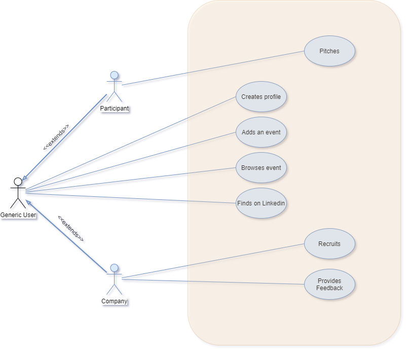
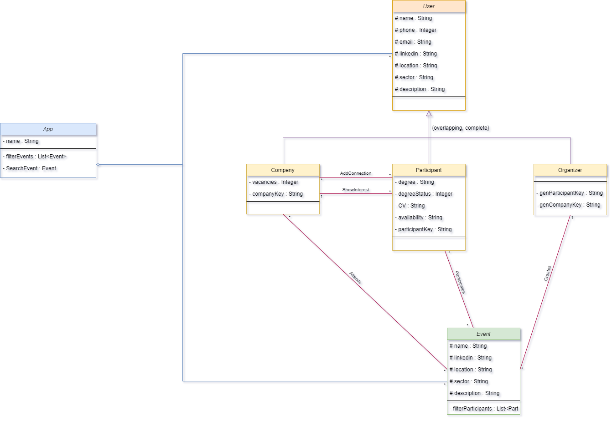

# openCX-teenage-mutant-coding-turtles Development Report

Welcome to the documentation pages of the Netfair of **openCX**!


You can find here detailed about the (sub)product, hereby mentioned as module, from a high-level vision to low-level implementation decisions, a kind of Software Development Report (see [template](https://github.com/softeng-feup/open-cx/blob/master/docs/templates/Development-Report.md)), organized by discipline (as of RUP): 

* Business modeling 
  * [Product Vision](#Product-Vision)
  * [Elevator Pitch](#Elevator-Pitch)
* Requirements
  * [Use Case Diagram](#Use-case-diagram)
  * [User stories](#User-stories)
  * [Domain model](#Domain-model)
* Architecture and Design
  * [Logical architecture](#Logical-architecture)
  * [Physical architecture](#Physical-architecture)
  * [Prototype](#Prototype)
* [Implementation](#Implementation)
* [Test](#Test)
* [Configuration and change management](#Configuration-and-change-management)
* [Project management](#Project-management)

So far, contributions are exclusively made by the initial team, but we hope to open them to the community, in all areas and topics: requirements, technologies, development, experimentation, testing, etc.

Please contact us! 

Thank you!

* [Adriana Cruz e Silva da Costa Gonçalves](https://github.com/adrianacscg)
* [João Nuno Diegues Vasconcelos](https://github.com/jf-ne-du-vp)
* [João Renato da Costa Pinto](https://github.com/joaorenatopinto)
* [Tiago Filipe Lima Rocha](https://github.com/SnarkyTohgo)

---

## Product Vision

Neftfair is an app designed to provide a simple and elegant solution to networking at online events, such as carreer fairs, tech fairs, etc. 
Empowered by sorting and filtering algorithms in a clean, oranized and user friendly UI, both companies and participants can interact together or comunicate with each other seamlessly, and view each others relevant information in a structured fashion using the apps features and functionalities. 

---
## Elevator Pitch

As of today's circumnstances due to COVID-19 virus, few events are prepared to effectively deliver the experience we, as atendees, are used to receive. Everything's often confusing and messy because of the high number of participants, and it's quite more difficult to methodicaly organize conferences and meetings within this specter. As **participants** it's not easy to understand which companies are interested in you, with whom should you aim to connect, or even how to find key individuals that also partake on the event in social media. As **companies**, it's hard to navigate through an overwhelming sea of participants, and filtering all the relevant information can prove to be a daunting challenge.

So we want to facilitate the entire process by showing the user who is participating on a given online conference (within a certain event), as well as all the companies present; mediate connections between participants and conferencees; and overall smoothen information filtering for both sides. All this to provide a cleaner, more organized experience for everyone envolved in those events.

---
## Requirements

### Functional requirements

* Users can be divided into 3 groups: Companies, Participants, and Organizers. Each group can be given separate rights (i.e. Organizers can create and post new events).
* Search option given to user to search users from various events. 
* Search option given to user to search for a given event. 
* Share option to share a certain event across diferent platforms.
* Calendarization feature to schedule and keep track of incoming events. 
* Users can choose to participate in an event from within the app, it being add to their events schedule.
* Links and anchors to relevant external platforms (i.e. social media profiles)
* Users can updload their CV into their profile

### Non-functional requirements

* Participants and Companies never allowed to edit events information.
* Participants and Companies have to be givven an access code upon entering a new event.
* The software should be portable. So moving from one OS to other OS does not create any problem.
* It should be capable enough to handle 100 000 users without affecting its performance.
* Users must complete their profile before navigating through the events.
* New users must choose their user group (Participant, Company, Organization) before navingating through the app.
* Users can change their user group at any time in the settings menu.

### User interface requirements

* Easy to operate 
* Quick in response
* Effectively handling operational errors
* Providing simple yet consistent user interface
* User friendly, unnecessary user interactions should be avoided.
* Extensibility and modularity, interoperable across a wide variety of platforms, media types and networks
* Efficient in terms of both speed and user interaction.


### Use case diagram 



##### Use case table 

Use Case ID | Use Case Name     | Primary Actor | Complexity |      
----------- | ----------------- | ------------- | ---------- |
1           | Creates profile   | Generic User  | High       |
2           | Adds an event     | Generic User  | Low        |
3           | Browses event     | Generic User  | High       |
4           | Finds on LinkedIn | Generic User  | Low        |
5           | Has interest in   | Company       | High       |
6           | Edit profile      | Generic User  | Med        |
7           | Create event      | Generic User  | Med        |


#### Case ID 1 - Creates profile
**Actor:** Generic User.

**Description:** A user will have to create a user profile containing their personal information, like their name, location, phone number, link to LinkedIn, brief description of themselves, etc. Both companies and participants have to create their profile, nevertheless as for the participants there is a public area containing the above mentioned information, and a private one containing information directed only at companies so only companies will be able to see that part of the participants's profile.      

**Preconditions and Postconditions:** First, the user must choose to be either a compay or a participant. In order to create a profile the user needs to register. To register they need to input their name, email/phone number and a password. After registering and loging into the app, the user needs to file a form with profile information and after they submit the form the profile will be created and saved in a database. The login information can be saved onto the device after one usage.

**Normal Flow:** After opening the app there will be a login form. If the user already has login credentials he may fill the form fields: email/phone number and password; and hit enter to access the full app. If they don't have the credentials, they must register with their email, phone number and password and then do the steps above to enter. After loging in for the first time in the app, the user will be redirected to a profile screen where there will be a form with multiple fields that the user will have to fill and then tap on a button to save the changes.

**Alternative Flows and Exceptions:** Mandatory fields not filled will occur in an error upon saving. Incorrect filling of certain fields will also result in an error. Errors will display as a message on the screen and saves will not happen.


#### Case ID 2 - Adds an event
**Actor:** Generic User.

**Description:** Each user has to add what events they are taking part of from a selection of events covered in a list on the app. That way, each event has a list of participants and companies atending it making filtering of information a lot easier, more practical and organized.

**Preconditions and Postconditions:** User must be registered and logged in. Once you add a certain event, have full access to the events features within the app, and it shall appear on each individual user's profile.  After adding an event, user will be promped with a success message.

**Normal Flow:** Users must double tap on an event to add it to their attending event list, enter the correspondent event code, and once done successfully it appears on their user profile. For security measures,this event code is given by the organization staff of the event.

**Alternative Flows and Exceptions:** If the event code is invalid, a message will appear on screen telling the user it is already full and te addition to their individual event list won't happen.


#### Case ID 3 - Browses event
**Actor:** Generic User.

**Description:** The user of NetFair has the ability to browse for events and into them, being totaly able to see what events are going on and who's attending what, and even filter that information by categories and order participants, companies and even events. There's even a feature to show/hide participants in an event. 

**Preconditions and Postconditions:** User must be registered and logged in. List of events available after filtering, or 

**Normal Flow:** Users can navigate through their events or find events within the app, filtering them by name,categories, or datetime. If the user taps on a given event in their event list they will open the correspondent event screen. On that new screen there will appear a schedule of the meetings and pannels that will occurr, and the user will be able to navigate through all the participants and companies attending it. If the user chooses to tap on the participant/company they will open their public profile, where they can see their info, message them, and more.

**Alternative Flows and Exceptions:** If no event corresponds to the search, then a message will appear, and no events will be shown. 


#### Case ID 4 - Finds on LinkedIn
**Actor:** Generic User.

**Description:** Both participants of an event and companies attending it will want to find each other on LinkedIn, and currently it can become a long and hard task. NetFair makes finding for connections on LinkedIn look like a walk in the park due to it's in-built system. That way when a participant wants to add some other participant to their LinkedIn network, or even a company, or vice-versa, they can within the tap of a button.

**Preconditions and Postconditions:** User must be registered and logged in. Opens LinkedIn app on the given user's profile.
 
**Normal Flow:** Tap the button "Find on LinkedIn" to open the LinkedIn app on the given user profile.

**Alternative Flows and Exceptions:** The user does not have a LinkedIn profile, in which case the button will appear in a different color, indicating it's disabled. The user does not have the LinkedIn app installed, in which case they will be redirected to the app store on the LinkedIn install page. 


#### Case ID 5 - Has interested in
**Actor:** Company.

**Description:** A company attending an event will often have the desire to  a given participant they think has potential. So they will contact the person they are interested in privatelly and talk to them within the grounds of the application, and the participant will know that the company has an interest in them.

**Preconditions and Postconditions:** User must be registered and logged in. User will be notified of a certain company's interest. An email will be sent to a partcipant whose "Interested" button has been clicked on.

**Normal Flow:** The company clicks on the "Interested" button next to a certain user, and a templated message will be sent to that user's email. Furthermore a notification will be sent to that user.

**Alternative Flows and Exceptions:** -


#### Case ID 6 - Edit profile
**Actor:** Generic User

**Description:** A user will be able to change the information in each field in their user profile.      

**Preconditions and Postconditions:** User must be registered and logged in.

**Normal Flow:** User taps on the "Edit" button on their user profile, and all the fields will be changeable. Once they're done, the user taps on "OK" to finish editing.

**Alternative Flows and Exceptions:** Invalid information put on certain fields will result in an error as well as empty mandatory fields.


#### Case ID 7 - Create event
**Actor:** Generic user

**Description:** A user will be able to create new events and add them to the application's list of available events. Upon creating the event, the user will have to enter the name of te event, a date and a thumbnail and the organizations name. Afterwards, two random access codes will be generated: one for participants and one for companies.         

**Preconditions and Postconditions:** User must be registered and logged in. Upon completion a new event is added to the applications event list. After creating the event an email will be sent to the creator containing both access codes, one to the participants and the other to the companies, so that both can safely enter the event.   

**Normal Flow:** User taps on the "Create Event" button, fills out the event creation form and taps on the the "Create" button to finish.     

**Alternative Flows and Exceptions:** Invalid information put on the form's fields, such as invalid dates for example, and mandatory fields left blank will result in an error mesage and won't be accepted.

### User stories

This section will contain the requirements of the product described as **user stories**, organized in a global **[user story map](https://plan.io/blog/user-story-mapping/)** with **user roles** or **themes**.

### User Stories


#### User Story ID 1 - Create user profile

As a user i want to be able to create a profile.

##### Acceptance Tests
```gherkin

  Scenario: Loging in as a Participant or Company
    Given I complete the profile wizard
    When I tap the “Finish” button
    Then I am redirected to the home screen and the profile is saved
```

##### Value
Must have

##### Effort
L


#### User Story ID 2 - Select type of user

As a user when I first enter the app I want to be able to choose if I am a company or a participant.

##### Acceptance Tests
```gherkin

  Scenario: Loging in for the first time
    Given I log in successfuly
    When I tap the “Participant”, or “Company”, or “Organization” button
    Then my user type is saved and I am redirected to the profile creation wizard
```

##### Value
Must have

##### Effort
S


#### User Story ID 3 - Add profile description

As a user I want to be able have a description of myself when creating a profile.

##### Acceptance Tests
```gherkin

  Scenario: Creating user profile
    Given I fill the first step of the profile creation wizard
    When I write my description in the description textarea field
    Then I can proceed  filling the profile form
```

##### Value
Must Have

##### Effort
S


#### User Story ID 4 - Create private profile section

As a participant I want to have a private profile directed for companies.

##### Acceptance Tests
```gherkin

  Scenario: Creating user profile
    Given I log in successfuly
    When I fill the first step of the profile creation wizard
    Then I can fill the private information fields in step 2 of the wizard
```

##### Value
Must have

##### Effort
S


#### User Story ID 5 - Choose attending events

As a user I want to be able to choose which events I am atending.

##### Acceptance Tests
```gherkin

  Scenario: I am in the home screen
    Given I logged in as a Participant
    When I tap the “Enter” button for an event
    Then I have successfuly chosen to attend that event and it is add to my schedule

  Scenario: I am in an event screen
    Given I logged in as a Participant
    When I tap the “Enter” button
    Then I have successfuly chosen to attend that event and it is add to my schedule
```

##### Value
Must have

##### Effort
M


#### User Story ID 6 - See event participants

As a user I want to see who is attending each event.

##### Acceptance Tests
```gherkin

  Scenario: I am in an event screen
    Given I log in successfuly
    When I tap the "Participants" button
    Then I can see a list of attending participants
```

##### Value
Must have

##### Effort
M


#### User Story ID 7 - See my events

As a user I want to see which events I am attending in the events callendar. 

##### Acceptance Tests
```gherkin

  Scenario: I am in any screen of the app
    Given I am logged in successfully
    When I tap on the calendar icon on the bottom navigation bar
    Then I can see a calendar containing the events I am atending in their respective dates
```

##### Value
Must have

##### Effort
M


#### User Story ID 8 - Filter events by work sector

As a user I want to be able to search for events in my interest areas.

##### Acceptance Tests
```gherkin

  Scenario: I am in any screen of the app
    Given I tap on the search icon on the bottom navigation bar
    When I type in sector keywords
    Then the resulting events appear
```

##### Value
Could have

##### Effort
M


#### User Story ID 9 - Search for participants

As a user I want to be able to search for people in my areas of interest in each event.

##### Acceptance Tests
```gherkin

  Scenario: I am in an event screen
    Given I tap on the participants button
    When I type in areas of interest keywords
    Then the resulting participants appear
```

##### Value
Could have

##### Effort
M


#### User Story ID 10 - Connect on LinkedIn

As a user I want to be able to connect with someone in my LinkedIn inside the app.

##### Acceptance Tests
```gherkin

  Scenario: I am in an event screen 
    Given I tap on the participants button and go to the participants list screen
    When I tap on the LinkedIn button next to a given participant
    Then I send them a connection request on LinkedIn
```

##### Value
Must have

##### Effort
L


#### User Story ID 11 - Find LinkedIn profile

As a user I want to easily find someones LinkedIn in their profile.

##### Acceptance Tests
```gherkin

  Scenario: I am in an event's participant list screen
    Given I tap on a given participant and navigate to their profile
    When I tap on their LinkedIn link
    Then I should be redirected to their linked in profile in their default web browser
```

##### Value
Must have

##### Effort
M


#### User Story ID 12 - Express interest

As a logged in Company I want to express interest in participants so that I can communicate with them.

##### Acceptance Tests
```gherkin

  Scenario: I am in an event's participant list screen
    Given I am logged in as a Company
    When I tap on a given participant's interest button
    Then a notification and an email is sent to that user
```

##### Value
Must have

##### Effort
M


#### User Story ID 13 - Edit profile

As a logged in Generic User I want to be able to edit my profile so that I can change the information about me available to others.

##### Acceptance Tests
```gherkin

  Scenario: I am in any screen of the app
    Given I tap on the profile icon and enter the user profile screen
    When I tap in the edit icon
    Then I can edit my profile information
```

##### Value
Must have

##### Effort
L


#### User Story ID 14 - Delete profile

As a logged in Generic User I want to be able to delete my profile so that I can delete the information about me available to others.

##### Acceptance Tests
```gherkin

  Scenario: I am in any screen of the app
    Given I tap on the settings icon and enter the user profile screen
    When I tap on the delete profile option
    And tap on the confirm button
    Then my user profile information is deleted
```

##### Value
Must have

##### Effort
M


#### User Story ID 15 - Create Event

As a logged in Generic User I want to create a new Event so that I can connect participants with companies on my event.

##### Acceptance Tests
```gherkin

  Scenario: Creating a new event
    Given I am logged in as an Organization
    When I tap on the "create new event" button
    And fill out the event creation wizard
    Then a new event is added to the event list and a notification is sent with the event's access code
```

##### Value
Must have

##### Effort
L


#### User Story ID 16 - Attend Event

As a logged in Generic User I want to receive the acess codes for my event via email so that I can share them with the participants and the companies attending.

##### Acceptance Tests
```gherkin

  Scenario: Entering an event
    Given I am logged in as a Participant or a Company
    When I tap on the "Enter" button for any event
    And input that event's access code
    Then that event is added to my schedule and I successfuly entered it
```

##### Value
Must have

##### Effort 
L


#### User Story ID 17 - Search Events

As a logged in Generic User I want to be able to search for a specific event so that I can easily find the one I want.

##### Acceptance Tests
```gherkin

  Scenario: Searching for events by name
    Given I tap on the search icon in the bottom navigation bar
    When I type in the name of an event
    Then that event appears listed bellow
```

##### Value
Could have

##### Effort
L


#### User Story ID 18 - Filter Events

As a logged in Generic User I want to be able to filter the events list so that I can easily find the ones I want.

##### Acceptance Tests
```gherkin

  Scenario: Filtering events
    Given I am on the home screen of the app
    When I tap on the filter icon and the dropdown appears
    And I select a filter
    Then the resulting events appear listed bellow
```

##### Value
Could have

##### Effort
L


#### User Story ID 19 - Search Participants

As a logged in Generic User I want to be able to search for a specific participant so that I can easily find the one I want.

##### Acceptance Tests
```gherkin

  Scenario: Searching for participants
    Given I am in an event's participants screen
    When I tap on the search bar
    And type the name of a participant in the search bar
    Then I can see the desired participant
```

##### Value
Could have

##### Effort
L


#### User Story ID 20 - Filter Participants

As a logged in Generic User I want to be able to filter the participants list so that I can easily find the ones I want.

##### Acceptance Tests
```gherkin

  Scenario: Searching for participants
    Given I am in an event's participants screen
    When I tap on the filter icon
    And select the desired filter option
    Then I can see a list of attending participants filtered by that option
```

##### Value
Could have

##### Effort
L


### Domain model




---

## Architecture and Design
The architecture of a software system encompasses the set of key decisions about its overall organization. 

A well written architecture document is brief but reduces the amount of time it takes new programmers to a project to understand the code to feel able to make modifications and enhancements.

To document the architecture requires describing the decomposition of the system in their parts (high-level components) and the key behaviors and collaborations between them. 

In this section you should start by briefly describing the overall components of the project and their interrelations. You should also describe how you solved typical problems you may have encountered, pointing to well-known architectural and design patterns, if applicable.

### Logical architecture
The purpose of this subsection is to document the high-level logical structure of the code, using a UML diagram with logical packages, without the worry of allocating to components, processes or machines.

It can be beneficial to present the system both in a horizontal or vertical decomposition:
* horizontal decomposition may define layers and implementation concepts, such as the user interface, business logic and concepts; 
* vertical decomposition can define a hierarchy of subsystems that cover all layers of implementation.

### Physical architecture
The goal of this subsection is to document the high-level physical structure of the software system (machines, connections, software components installed, and their dependencies) using UML deployment diagrams or component diagrams (separate or integrated), showing the physical structure of the system.

It should describe also the technologies considered and justify the selections made. Examples of technologies relevant for openCX are, for example, frameworks for mobile applications (Flutter vs ReactNative vs ...), languages to program with microbit, and communication with things (beacons, sensors, etc.).

### Prototype
To help on validating all the architectural, design and technological decisions made, we usually implement a vertical prototype, a thin vertical slice of the system.

In this subsection please describe in more detail which, and how, user(s) story(ies) were implemented.

---

## Implementation
Regular product increments are a good practice of product management. 

While not necessary, sometimes it might be useful to explain a few aspects of the code that have the greatest potential to confuse software engineers about how it works. Since the code should speak by itself, try to keep this section as short and simple as possible.

Use cross-links to the code repository and only embed real fragments of code when strictly needed, since they tend to become outdated very soon.

---

## Test

We used the [github issues](https://github.com/FEUP-ESOF-2020-21/open-cx-t4g5-teenage-mutant-coding-turtles/issues) and [project](https://github.com/FEUP-ESOF-2020-21/open-cx-t4g5-teenage-mutant-coding-turtles/projects/1) to organize our project.

Unit Tests are used to verify the expected output after the user interacts with the application and have been implemented using the `flutter_test` dependency.

### Unit Tests

#### Implemented Unit Tests

* User Model to Json

#### Unit Tests to be made

* Interactions in login screen
* Interactions in Register
* Interactions in Profile Creation Screen
* Interactions in Home Screen
* Interactions in Create Event Screen
* Interactions in AppBar
* Interactions in NavBAr
* Event creation
* Event Model to Json
* Sign In
* Sign Out

---

## Configuration and change management

Configuration and change management are key activities to control change to, and maintain the integrity of, a project’s artifacts (code, models, documents).

For the purpose of ESOF, we will use a very simple approach, just to manage feature requests, bug fixes, and improvements, using GitHub issues and following the [GitHub flow](https://guides.github.com/introduction/flow/).


---

## Project management

Software project management is an art and science of planning and leading software projects, in which software projects are planned, implemented, monitored and controlled.

To keep track of all of this the team adopted [Github Projects](https://github.com/FEUP-ESOF-2020-21/open-cx-t4g5-teenage-mutant-coding-turtles/projects/1)!
